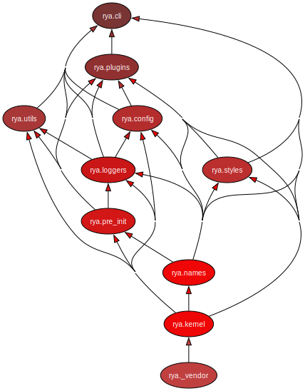

# Rya Codebase

Rya's codebase is split into sub-packages that we refer to as _layers_. The layers form a hierarchy, following the
[Simple Microkernel Architecture (SMA)](https://books.ub.uni-heidelberg.de/heibooks/catalog/book/1652/chapter/23952). A
top layer depends upon or uses the APIs of a bottom layer, and never the other way around.

